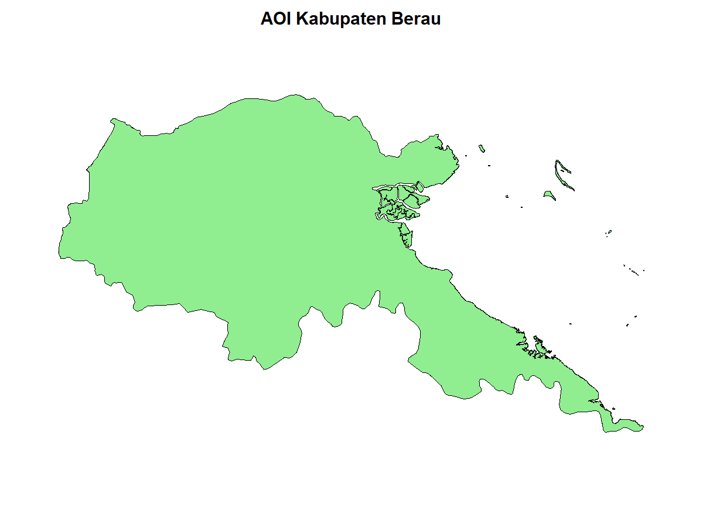

# Berau Deforestation, Forest Fragmentation, and Carbon Stock Analysis

This repository presents a spatial analysis project of deforestation, forest fragmentation, and carbon stock in **Berau Regency, East Kalimantan, Indonesia**, using **R**.

The project includes the main analysis script, summary tables, and visualization outputs generated to examine forest change patterns and carbon-related indicators. This repository is designed as a portfolio project for environmental data analysis, spatial analysis, and forest monitoring.

## Project Overview

The main objective of this project is to analyze forest landscape change in Berau Regency through:

- annual deforestation trends
- remaining forest trends
- forest fragmentation patterns
- carbon stock distribution

This project demonstrates the use of **R** for environmental and geospatial analysis, with outputs that can support reporting, research, and data-driven decision-making.

## Repository Contents

### Main Script
- `project_berau_deforestasi_fragmentasi_karbon.R`  
  Main R script for data processing, analysis, and visualization.

### Figures
- `01_aoi_berau.png` — Area of interest map
- `02_deforestation_year_map_berau.png` — Deforestation year map
- `03_deforestation_annual_loss_berau.png` — Annual deforestation loss chart
- `04_remaining_forest_trend_berau.png` — Remaining forest trend chart
- `05_patch_map_2002_2022_berau.png` — Forest fragmentation / patch map
- `06_carbon_stock_2022_berau.png` — Carbon stock map for 2022

### Summary Tables
- `carbon_summary_berau.csv`
- `deforestation_annual_berau.csv`
- `final_summary_berau.csv`
- `fragmentation_metrics_summary_berau.csv`

## Tools and Methods

- **Programming Language:** R
- **Analysis Type:** Spatial and environmental data analysis
- **Outputs:** Maps, charts, and summary tables
- **Study Area:** Berau Regency, East Kalimantan, Indonesia

## Key Outputs

This repository provides:

- visual evidence of forest cover change
- annual deforestation trend summaries
- forest fragmentation indicators
- carbon stock information for the study area

## Visualizations

### Area of Interest

### Deforestation Year Map

### Annual Deforestation Loss

### Remaining Forest Trend

### Forest Fragmentation / Patch Map

### Carbon Stock Map

## Purpose

This repository was developed as a mini project to showcase practical skills in:

- R programming
- spatial analysis
- environmental assessment
- forest and carbon-related data visualization

## Author

**M. Dedy Lesmana**  
Environmental and spatial data analysis portfolio project.

## Contact

For collaboration, freelance work, or project inquiries, please contact me through my GitHub profile.
This project presents a spatial analysis of deforestation, forest fragmentation, and carbon stock in Berau Regency, East Kalimantan, Indonesia, using **R**.

The repository contains the main analysis script, summary tables, and figure outputs generated from the project. It is intended as a portfolio project for environmental data analysis, spatial analysis, and forest monitoring.

## Project Overview

The main objective of this project is to analyze forest change patterns in Berau Regency through:
- annual deforestation trends
- remaining forest trends
- forest fragmentation patterns
- carbon stock distribution

This project demonstrates the use of R for environmental and geospatial data analysis, with outputs that can support reporting, research, and decision-making.

## Repository Contents

### Script
- `project_berau_deforestasi_fragmentasi_karbon.R`  
  Main R script for data processing, analysis, and visualization.

### Figures
- `01_aoi_berau.png` — Area of interest map
- `02_deforestation_year_map_berau.png` — Deforestation year map
- `03_deforestation_annual_loss_berau.png` — Annual deforestation loss chart
- `04_remaining_forest_trend_berau.png` — Remaining forest trend chart
- `05_patch_map_2002_2022_berau.png` — Forest fragmentation / patch map
- `06_carbon_stock_2022_berau.png` — Carbon stock map for 2022

### Summary Tables
- `carbon_summary_berau.csv`
- `deforestation_annual_berau.csv`
- `final_summary_berau.csv`
- `fragmentation_metrics_summary_berau.csv`

## Tools and Methods

- **Programming Language:** R
- **Analysis Type:** Spatial and environmental data analysis
- **Outputs:** Maps, charts, and summary tables
- **Study Area:** Berau Regency, East Kalimantan, Indonesia

## Key Outputs

This repository provides:
- visual evidence of forest cover change
- annual deforestation trend summaries
- forest fragmentation indicators
- carbon stock information for the study area

## Preview

### Area of Interest

### Annual Deforestation Loss

### Carbon Stock Map

## Purpose

This repository is part of a mini project developed to showcase practical skills in:
- R programming
- spatial analysis
- environmental assessment
- forest and carbon-related data visualization

## Author

**M. Dedy Lesmana**  
Environmental and spatial data analysis portfolio project.

## Contact

For collaboration, freelance work, or project inquiries, please contact me through my GitHub profile.
